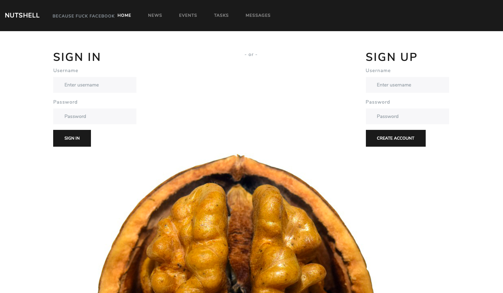
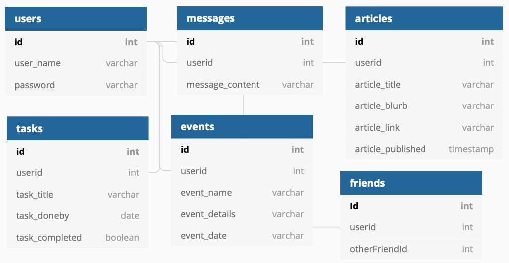

# Nutshell 
Time to leave the Book of Faces to the Baby Boomers and the Russians. Nutshell is the NEXT GEN social media platform.

Soon to feature cryptocurrency micro payments, and cross border gambling.



## Developed by THE => PHAT => ARROWS
- Jason Brooks (King of the North, Lead Dev)
- Josh Webb (Spiritual Leader, Social Media SME)
- Dek Haji (Commander of the Northern Forces, JS Guru)
- Ken Dixon (Maester of the Databases)

### Setup Nutshell
1. Clone the browserify-boilerplate repo.
2. Do not touch the .gitignore file that's there. It has everything you need.
3. git remote remove origin.
4. git remote add origin paste_your_nutshell_repo_string_here.
5. git push origin master.
6. In Terminal navigate to src/lib. 
7. Run Browserify.
```
 $ npm install
 ```
8. Run Grunt.
```
$ grunt
```

### Assignment Professional Requirements
1. All teammates must be using Grunt to run ESLint and Browserify during development
2. Each module should have a comment at the top with the following info: author(s) and purpose of module
3. The README for your project should include instructions on how another person can download and run the application


### Database Diagram
